# INVAR

[](https://github.com/anomly-labs/invar/actions/workflows/tests.yml)
[](LICENSE)

*Short for **invariant** — in physics, the quantity every observer computes
identically, no matter their frame of reference. Now your AI has one.*

**Local AI that proves its work.** INVAR runs LLMs on your own hardware and gives
every answer a *worldline*: a hash-chained, re-executable receipt binding the
runtime, model weights, prompt, and parameters to the output. Verify anything
with one command. No cloud. No account. No telemetry.

```
$ invar serve --model llama3.2            # Ollama tag — or a llama.cpp .gguf path
$ curl localhost:8577/v1/chat/completions -d '{"messages":[{"role":"user","content":"The capital of France is"}]}'
```
```json
{
  "choices": [{ "message": { "content": "The capital of France is Paris." } }],
  "receipt": {
    "certificate": "sha256:80fcf3e78ebbf7df2adf4…",
    "chain": "sha256:4efc59f2f274f088221971…",
    "profile": "ollama-pinned-reexec-v0"
  }
}
```
```
$ invar verify worldline.jsonl
entry 0: ACCEPT — re-executed, output digest matches
```

Edit one byte of the log and verification **REJECTS**. That's the product.



## Install

On the system you already run — nothing flashed, nothing replaced:

```
curl -fsSL https://www.anomly.com/get/invar.sh | sh
```

Requirements: Python 3.10+ and one engine: [Ollama](https://ollama.com) (used
as-is; `invar serve --model <tag>`) or a llama.cpp `llama-cli` on PATH (or
`INVAR_LLAMA_BIN`; `invar serve --model file.gguf`). Docker and systemd
deployments: see the [Dockerfile](Dockerfile) header and [deploy/](deploy/).
Full walkthrough: [docs/QUICKSTART.md](docs/QUICKSTART.md).

## Works with what you already run

INVAR is an OpenAI-compatible endpoint, so Open WebUI, aider, Continue, the
OpenAI SDKs, LangChain and LlamaIndex connect to it unchanged — every answer
they get carries a receipt. Exact configs: [docs/INTEGRATIONS.md](docs/INTEGRATIONS.md).

What an Ollama-backed receipt pins: sha256 of the `ollama` binary, the model
manifest digest (weights + template + params), the GGUF blob digest, and the
decode parameters. Verification re-asks Ollama and compares output digests;
a re-pulled tag, a swapped binary, or a moved GPU layer split is a REJECT,
never a silent pass.

## What a receipt proves — and what it doesn't

A receipt proves that **this runtime + these weights + this prompt + these
parameters produced exactly this output**, and that the record hasn't been
altered since — checkable by re-hashing, and by re-running. It does **not**
grade the answer, and the default profiles pin reproducibility to a deployment
(same box, binary, weights); cross-machine bit-exact inference is a separate
verification-grade profile from Anomly's exact-arithmetic work. The full trust
boundary, including accepted risks, is written down in
[docs/THREATMODEL.md](docs/THREATMODEL.md) — we'd rather you read it than
discover it.

## The pieces

| Piece | What it does | Cost |
|---|---|---|
| `invar serve` | OpenAI-compatible local endpoint; every completion carries its receipt | free |
| `invar verify` | structural + re-execution verification of any worldline | free, forever |
| `invar license` | offline Ed25519 license files — no activation server, no phone-home | — |
| `invar ledger` | team collection plane: verifies every entry at ingest, exports certified chain-of-custody packets | [licensed](https://www.anomly.com/invar) |

Receipts are built on the open
[Computation Receipts (CR-v0.1)](https://github.com/anomly-labs/computation-receipts)
specification — public spec, published conformance vectors, independent
implementations. Verification is a property of the format, not a feature we
gatekeep.

## Tests

The full battery runs **offline** — no model, GPU, or network. Deterministic
stand-ins for llama.cpp and for the Ollama API cover the inference /
verification / re-execution / deployment-drift paths, so even those run in CI.
Set `INVAR_TEST_OLLAMA_MODEL=<tag>` to run the same checks against a real
Ollama. Only dependency is `cryptography`.

```
sh tests/run_all.sh
```

Six gates run: fine-grained unit coverage (~97%), integration smokes, a
serve-concurrency + property-fuzz stage, and release / installer / deploy sanity
— plus a mutation battery that proves the suite catches real bugs. To exercise a
real model instead of the stand-in:

```
INVAR_TEST_MODEL=your.gguf INVAR_TEST_BINARY=$(command -v llama-cli) python3 tests/test_invar.py
```

Details: [tests/README.md](tests/README.md).

## License

Apache-2.0 (see [LICENSE](LICENSE)). INVAR Ledger team features are unlocked by
commercially issued license files; pricing at
[anomly.com/invar](https://www.anomly.com/invar). Contact:
[anomly.com/contact](https://www.anomly.com/contact).

© 2026 Anomly, Inc.
